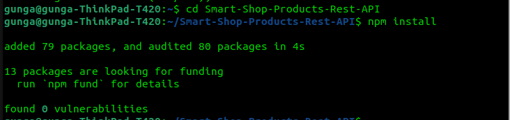

## How To Run This Project

### Step 1: Clone the Repo to your locat storage

Open your terminal and navigate the the folder you want to store the projects and run the following command:

`git clone https://github.com/Manase44/Smart-Shop-Products-Rest-API.git`


### Step 2: Install packages

Run the following commands to install the packages inside the project:

`cd cd Smart-Shop-Products-Rest-API`

Then:

`npm install`



### Step 3: Connect to a postgres database and run the application

Make sure you have [postreSQL](https://www.postgresql.org/download/) installed and correctly configured.

Create a database a database using the `CREATE DATABASE` command and specify its name.

Create a table names `products` with the following collumns:

`id`,  
`productThumbnail`,  
`productTitle`,  
`productDescription`,  
`productCost`, and  
`onOffer`.

Insert records to the table using the `INSERT INTO (...) VALUES (...)` command.

Create a `.env` file at the root of you project and replace `value` with your actual postgres user, password, host server, port, and the database name.

```json
POSTGRES_USER=value
POSTGRES_PASSWORD=value
POSTGRES_HOST=value
POSTGRES_PORT=value
POSTGRES_DB=value
```

Great! You have successful connected the application with your database. Run command `npm run dev` in the terminal to run your application server.

### step 4: Launch your favorite API platform

Open your API platform, I will use post man for demonstartion:

Click on `new` to creat a new request:


Click `HTTP`:


### Step 5: Send your HTTP requests

Very well, you can now make you requests with the following API endpoints (_make sure to use your suplied host sever in place of localhost_):

1. Getting all products

   `GET` localhost:3000/products

   

2. Getting a single product

   `GET` localhost:3000/products/`product-id e.g. 2`

   

3. Creating a new product
   `POST` json data at endpoint : localhost:3000/products

   

4. Updating a product

   `PATCH` json data at endpoint: localhost:3000/products/`product-id e.g. 2`

   

5. Delete a product

   `DELETE` localhost:3000/products/`product-id e.g. 2`

   
